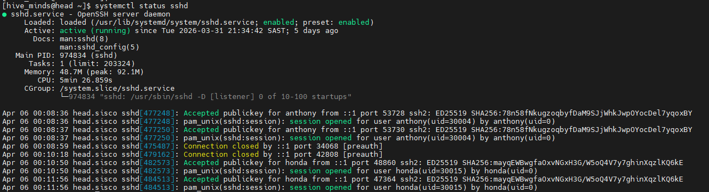
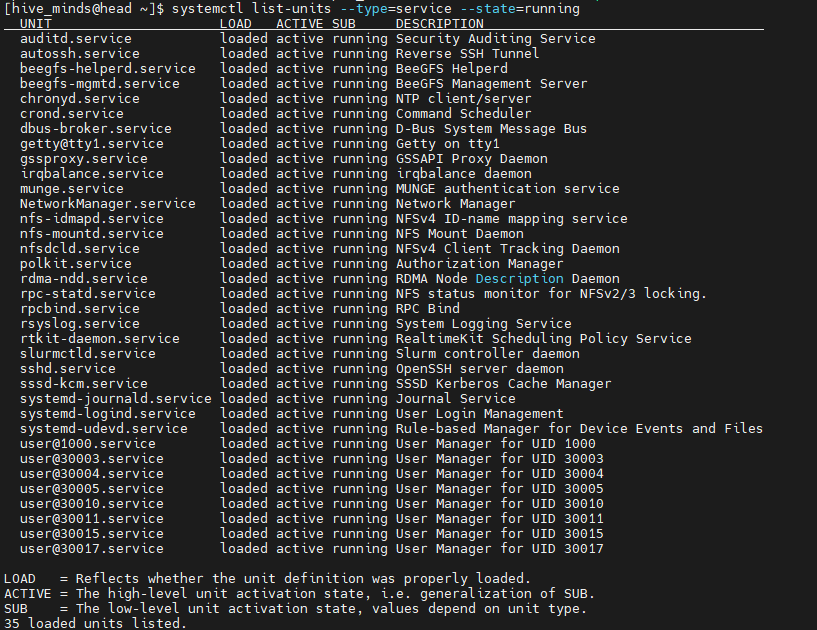
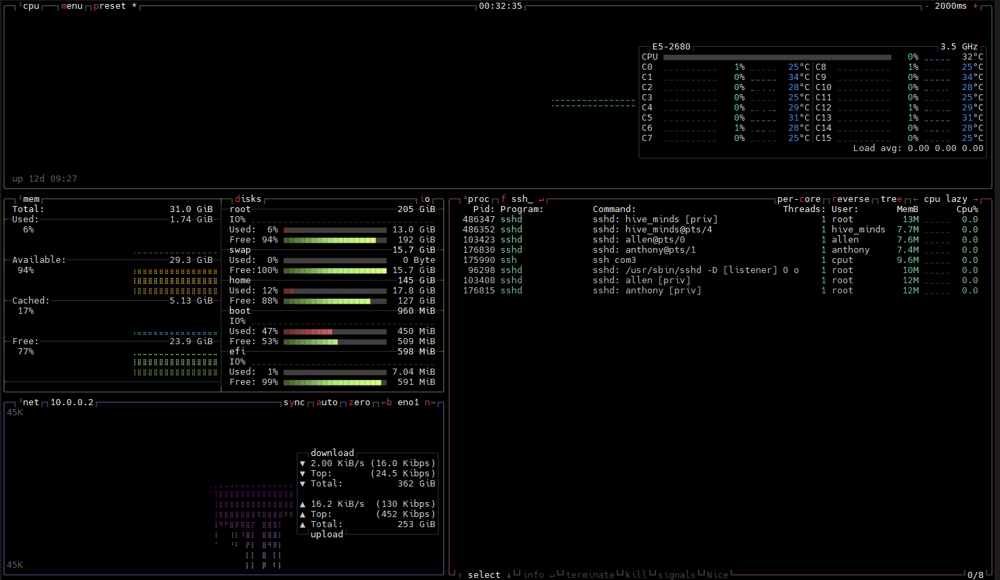
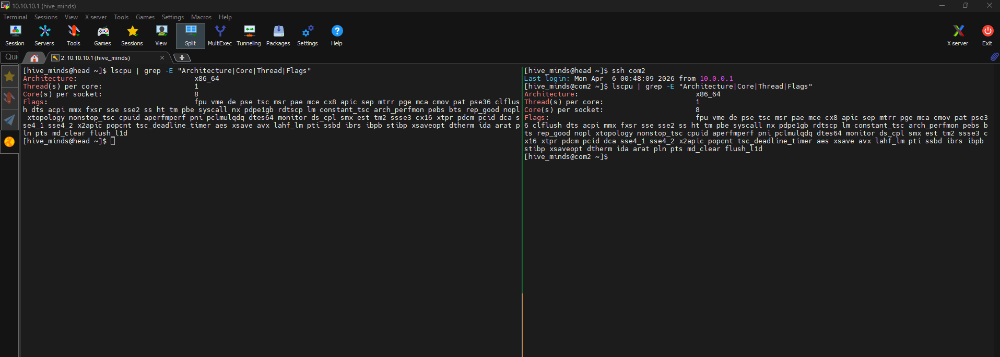
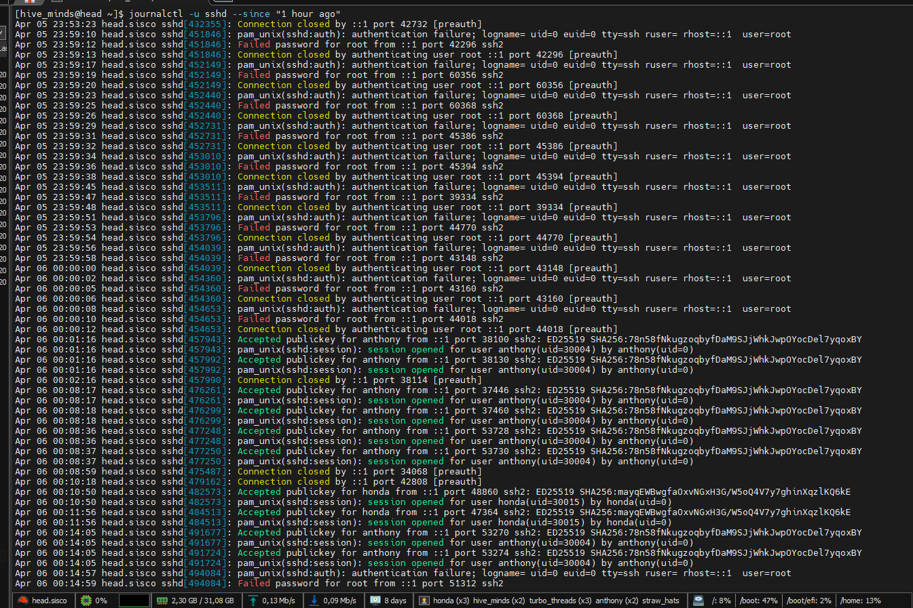

# Hive_minds Task 2:

## Question 1:

Get the status of the SSH service on the head node:

```bash
#'Systemctl' accesses and manages the services in Linux, the 'status sshd' lists the statuses of the SSH services

systemctl status sshd
```
Our results printed out:




## Question 2:

Using systemctl, get the list of all running services on the head node:

```bash
#'--type==<item or object>' specifies the type of object or item to be indentified
#'--state==<specified status>' identifies the condition such as running or inactive statuses

systemctl list-units --type=service --state=running
```
Our results printed out:




## Question 3:

Using htop or btop on com1 or com2, identify the SSH process:

```bash
#We used btop which monitors use of resources

btop
```
Our results printed out:




## Question 4:

Use lscpu and the grep command to get the CPU details of head and com2. Use tmux to display both windows of head and com2 simultaneously. Show the following details: architecture, number of cores, and CPU flags.

The results from our commands and commands used:

```bash
#CPU details are accessed
lscpu | grep -E 'Architecture|Core|Flags'
#Window is split
tmux split-window -v

#Alternative used (Issue accessing coms node)
tmux
[ctrl+b] + [%] to split window
lscpu | grep -E "Architecture|Core|Thread|Flags"
[ctrl+d] + [right arrow key]
ssh com2
lscpu | grep -E "Architecture|Core|Thread|Flags"
```
 


## Question 5:

Use journalctl (on the head node) to retrieve all SSH logs from the last hour:

```bash
#Displays recent SSH logs within the hour
journalctl -u sshd --since "1 hour ago"
```


