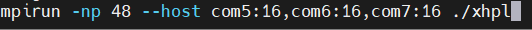

# Hive_minds Task 5:

## Benchmarks results with screenshots:
Step 1 Job allocation:
```bash
salloc --partition=club --time=59:00 -N 3 -n=48 --job-name=task5 --nodelist=com5,com6,com7
```


Step 2 Running mpirun:
```bash
#since we allowed 48 task we used 16 cores on each of the two coms
mpirun -np -48 --host com5:16,com6:16,com7:16 ./xhpl
```

